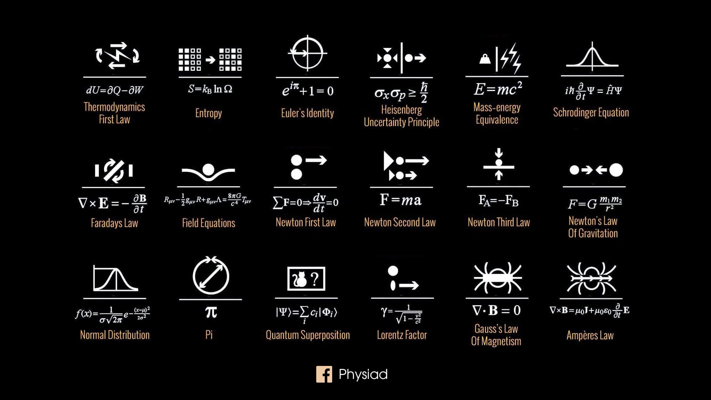

Dựa trên hai cuốn sách mà mình tự học là "Giáo trình: Nhập môn lý thuyết ma trận" của Nhà xuất bản đại học sư phạm, "Toán học cao cấp (tập 1): Đại số và hình học giải tích" và "Toán học cao cấp (tập 2): Giải tích" của Nhà xuất bản giáo dục Việt Nam. 

## 1. Lý thuyết tập hợp (hữu hạn)

**Định nghĩa 1.1**: 

> Tập hợp là một khái niệm cơ bản không được định nghĩa, mà được hiểu như là một sự tụ tập những sự vật hoặc những đối tượng nhất định (và thường có cùng một hoặc một số tính chất chung nào đó). Mỗi sự vật hoặc đối tượng đó được gọi là một phần tử  của tập hợp. 

**Ví dụ 1.2**: 

Tập hợp các số tự nhiên: 0, 1, 2, 3, ...

Tập hợp các số nguyên: ...-1, -2, 0, 1, 2, ...

Tập hợp thường được kí hiệu bởi các chữ cái in hoa, chẳng hạn như *X, Y, Z, ...* Phần tử thường được kí hiệu bởi chữ cái in thường *x, y, z, ...*

**Ví dụ 1.3**:

Tập hợp các số tự nhiên: \\\(\mathbb{N}\\\)

Tập hợp các số thực: \\\(\mathbb{R}\\\)

Nếu phần tử *x* thuộc tập hợp *X* thì ta kí hiệu là \\\(x \in X\\\). Nếu phần tử *x* không thuộc tập hợp *X* thì ta kí hiệu là \\\(x \notin X\\\). 

**Ví dụ 1.4**: Cho một tập hợp là các số tự nhiên \\\(\mathbb{N}\\\):

Phần tử 1 thuộc tập hợp các số tự nhiên \\\(\mathbb{N}\\\), kí hiệu 1 \\\(\in \mathbb{N}\\\).

Phần tử -1 không thuộc tập hợp các số số tự nhiên \\\(\mathbb{N}\\\), kí hiệu -1 \\\(\notin \mathbb{N}\\\).

Một tập hợp không chứa phần tử nào được gọi là tập rỗng, và được kí hiệu là \\\(\emptyset\\\). 

**Ví dụ 1.5**: Tập hợp nghiệm thực của phương trình \\\(x^2 + 1 = 0\\\) là tập hợp \\\(\emptyset\\\).

Để biểu diễn một tập hợp, ta có thể liệt kê các phần tử của tập hợp đó:

> $$X = \{x_1, x_2, \dots\}$$

**Ví dụ 1.6**: Tập hợp năm số tự nhiên \\\(\mathbb{N}\\\) đầu tiên được biểu diễn ở dạng liệt kê như sau:

$$\mathbb{N} = \{0, 1, 2, 3, 4, 5\}$$

Ta cũng có thể biểu diễn tập hợp bằng cách chỉ rõ các tính chất đặc trưng của các phần tử của tập hợp:

> $$X = \{x|P(x)\}$$

với *P(x)* là tính chất của phần tử thuộc tập hợp *X*.

**Ví dụ 1.7**: Tập hợp các số hữu tỉ \\\(\mathbb{Q}\\\) được biểu diễn bằng cách chỉ rõ tính chất đặc trưng của mỗi phần tử như sau: 

$$\mathbb{Q} = \{\frac{a}{b}|a, b \in \mathbb{Z}, b \ne 0\}$$

**Ví dụ 1.8**: Tập nghiệm của hệ phương trình 

$$\begin{cases}
  x + y + z = 1 \\
  x + 2y + 3z = 0
\end{cases}$$

là tập hợp:

$$S = \{(x, y ,x)| x, y, z \in \mathbb{R}, x + y + x = 1, x + 2y + 3z = 0\}$$

Để mô tả tập hợp một cách trực quan, người ta biểu diễn mỗi tập hợp bởi các điểm nằm trong một vòng phẳng mà ta gọi là biểu đồ Ven.

***

## 2. Ánh xạ 

Để nghiên cứu mối quan hệ giữa hai tập hợp, ta tập trung tìm hiểu các quy tắc cho tương ứng mỗi phần tử của tập hợp này với mỗi phần tử của tập hợp kia. Một lớp quy tắc như thế dẫn đến định nghĩa như sau.

**Định nghĩa 2.1**: 

> Cho *X* và *Y* là hai tập hợp khác rỗng. Một ánh xạ *f* từ *X* đến *Y* là một quy tắc cho tương ứng mỗi phần tử \\\(x \in X\\\) với một và chỉ một phần tử \\\(y \in Y\\\). Phần tử *x* được gọi là tạo ảnh của phần tử *y* qua ánh xạ *f*. Phần tử *y* được gọi là ảnh của phần tử *x* qua ánh xạ *f* và kí hiệu là *f(x)*.

Ánh xạ *f* từ *X* đến *Y* được kí hiệu là: 

> $$ f: X \to Y, x \mapsto y = f(x) $$

Tập *X* được gọi là tập nguồn hay tập xác định của ánh xạ *f*. Tập *Y* được gọi là tập đích.

**Ví dụ 2.2**: Cho \\\(f: \mathbb{R} \to \mathbb{R}, x \mapsto x^2\\\). 

Vì \\\(f(2) = f(-2) = 2^2 = (-2)^2 = 4\\\) nên 4 là ảnh của 2 và -2. Còn 2 và -2 đều là tạo ảnh của 4.

Từ **định nghĩa 2.1** về ánh xạ, ta có các khái niệm về đơn ánh, toàn ánh, song ánh. 

**Định nghĩa 2.3**: Cho \\\(f: X \to Y\\\) là một ánh xạ: 

> (i) Ánh xạ *f* được gọi là ***đơn ánh*** nếu \\\(\forall x_1, x_2 \in X, x_1 \ne x_2\\\) kéo theo \\\(f(x_1) \ne f(x_2)\\\). Điều đó tương đương với: \\\(\forall x_1, x_2 \in X, f(x_1) = f(x_2)\\\) kéo theo \\\(x_1 = x_2\\\)

> (ii) Ánh xạ *f* được gọi là ***toàn ánh*** nếu \\\(f(x) = y\\\), nghĩa là \\\(\forall y \in Y\\\), \\\(\exists x \in X\\\) sao cho \\\(y =f(x)\\\). 

> (iii) Ánh xạ *f* được gọi là ***song ánh*** nếu ánh xạ *f* vừa là ***đơn ánh*** và đồng thời cũng là ***toàn ánh***.

**Ví dụ 2.4**: Cho \\\(f: [0;\infty] \to \mathbb{R}, x \mapsto x^2\\\)

Với \\\(x_1 = 1 \in [0;\infty]\\\) ta được \\\(y_1 = f(x_1) = 1^2 = 1 \in \mathbb{R}\\\)

Với \\\(x_2 = 2 \in [0;\infty]\\\) ta được \\\(y_2 = f(x_2) = 2^2 = 4 \in \mathbb{R}\\\)

Vì \\\(x_1 \ne x_2\\\) \\\((1 \ne 2)\\\) kéo theo \\\(f(x_1) \ne f(x_2)\\\) \\\((1 \ne 4)\\\) nên \\\(f: [0;\infty] \to \mathbb{R}, x \to x^2\\\) là ***đơn ánh***.

Với \\\(y = -1\\\), \\\(\nexists x \in [0;\infty]\\\) sao cho \\\(x^2 = -1\\\). Vậy nên \\\(f: [0;\infty] \to \mathbb{R}, x \to x^2\\\)  không là ***toàn ánh***.

Vì ánh xạ \\\(f: [0;\infty] \to \mathbb{R}, x \to x^2\\\)  chỉ là **đơn ánh** mà không phải là **toàn ánh**, nên ánh xạ này không phải là ***song ánh***.

**Ví dụ 2.5**: Cho \\\(f: \mathbb{R} \to [0; \infty], x \mapsto x^2\\\)

Với \\\(x_1 = -1 \in \mathbb{R}\\\) ta được \\\(y_1 = f(x_1) = (-1)^2 = 1 \in [0;\infty]\\\)

Với \\\(x_2 = \sqrt{2} \in \mathbb{R}\\\) ta được \\\(y_2 = f(x_2) = (\sqrt{2})^2 = 2 \in [0;\infty]\\\)

Vậy \\\(\exists x \in \mathbb{R}\\\) để \\\(y = f(x) = x^2\\\), nên \\\(f: \mathbb{R} \to [0; \infty], x \mapsto x^2\\\) là ***toàn ánh***.

Với \\\(x_3 = 1 \in \mathbb{R}\\\) ta được \\\(y_3 = f(x_3) = 1^2 = 1 \in [0;\infty]\\\) 

Vì \\\(x_1 \ne x_3\\\) \\\((-1 \ne 1)\\\) mà kéo theo \\\(f(x_1) = f(x_3)\\\), nên \\\(f: \mathbb{R} \to [0; \infty], x \mapsto x^2\\\) không là ***đơn ánh***.

Vì ánh xạ \\\(f: \mathbb{R} \to [0;\infty], x \to x^2\\\)  chỉ là **toàn ánh** mà không phải là **đơn ánh**, nên ánh xạ này không phải là ***song ánh***.

**Ví dụ 2.6**: Cho \\\(f: [0;\infty] \to [0;\infty], x \to x^2\\\)

Với \\\(x_1 = 1 \in [0;\infty]\\\) ta được \\\(y_1 = f(x_1) = 1^2 = 1 \in [0;\infty]\\\)

Với \\\(x_2 = 2 \in [0;\infty]\\\) ta được  \\\(y_2 = f(x_2) = 2^2 =4 \in [0;\infty]\\\)

Vì \\\(x_1 \ne x_2\\\) \\\((1 \ne 2)\\\) kéo theo \\\(f(x_1) \ne f(x_2)\\\) \\\((1 \ne 4)\\\) nên \\\(f: [0;\infty] \to \[0;\infty], x \to x^2\\\) là ***đơn ánh***.

Hơn nữa, \\\(\exists x \in [0;\infty]\\\) để \\\(y = f(x) = x^2\\\), nên \\\(f: [0;\infty] \to [0; \infty], x \mapsto x^2\\\) là ***toàn ánh***.

Vì ánh xạ \\\(f: [0;\infty] \to [0;\infty], x \to x^2\\\) vừa là **đơn ánh** và cũng là vừa **toàn ánh** nên ánh xạ này là ***song ánh***.

*** 

## 3. Số phức 

**Định nghĩa 3.1**: Số phức là một biểu thức có dạng 

$$z = a +b.i$$

trong đó \\\(a, b \in \mathbb{R}\\\), và \\\(i\\\) là một kí hiệu được gọi là đơn vị ảo.

Số thực \\\(a\\\) được gọi phần thực của số phức \\\(z\\\), kí hiệu là \\\(\operatorname{Re}(z)\\\). Số thực \\\(b\\\) được gọi là phần ảo của số phức \\\(z\\\), kí hiệu là \\\(\operatorname{Im}(z)\\\).

Tập hợp các số phức được kí hiệu là \\\(\mathbb{C}\\\)

**Ví dụ 3.2**: Cho \\\(z = 10\\\) là một số phức, có phần thực là \\\(\operatorname{Re}(z) = 10\\\) và có phần ảo là \\\(\operatorname{Im}(z) = 0\\\)

Từ **ví dụ 3.2** trên, ta thấy rằng, mỗi số thực \\\(a\\\) được đồng nhất bởi số phức \\\(a + 0.i\\\), với \\\(a \in \mathbb{R}\\\). Như vậy, ta có bao hàm thức giữa các tập hợp số như sau: 

$$\mathbb{N} \subset \mathbb{Z} \subset \mathbb{Q} \subset \mathbb{R} \subset \mathbb{C}$$

Quy ước: \\\(i = \sqrt{-1}\\\). 

**Định nghĩa 3.3**: Hai số phức \\\(z_1 = a + b.i\\\) và \\\(z_2 = a'+b'.i\\\), với \\\(a, b, a' , b' \in \mathbb{R}\\\) là bằng nhau nếu và chỉ nếu:

$$\begin{cases}
  a = a' \\
  b = b'
\end{cases}$$

**Ví dụ 3.4**: Cho hai số phức \\\(z_1 = a + 3.i\\\) và \\\(z_2 = 2 + b'.i\\\), với(\\\(a, b \in \mathbb{R}\\\)). Khi đó \\\(z_1 = z_2\\\) nếu là chỉ nếu

$$\begin{cases}
  a = 2 \\
  b'= 3
\end{cases}$$

**Định nghĩa 3.5 (Số phức liên hợp)**: Cho số phức \\\(z = a + b.i\\\), với \\\(a, b \in \mathbb{R}\\\): 

> Số phức \\\(\bar{z} = a - b.i\\\) được gọi là số phức liên hợp của số phức \\\(z = a + b.i\\\) với phần thực của số phức liên hợp là \\\(\operatorname{Re}(z) = a\\\) và phần ảo của số phức liên hợp là \\\(\operatorname{Im}(z) = -b\\\). 

**Ví dụ 3.6**: Cho số phức \\\(z_1 = 3 + 4.i\\\): 

Ta tìm được số phức liên hợp từ số phức \\\(z_1\\\) là \\\(\overline{z_1} = 3 - 4.i\\\)

**Định nghĩa 3.7 (Mô đun số phức)**: Cho số phức \\\(z = a + b.i\\\), với \\\(a, b \in \mathbb{R}\\\):

> Số thực không âm \\\(\lvert z \lvert = \sqrt{a^2 + b^2}\\\) được gọi là mô đun của số phức \\\(z\\\)

Lấy lại **ví dụ 3.6** trên, ta tìm được mô đun của số phức \\\(z_1\\\) là \\\(\lvert z_1 \lvert = \sqrt{3^2 + 4^2} = 5\\\). 

Mô đun của số phức liên hợp từ số phức \\\(z_1\\\) là \\\(\lvert \overline{z_1} \lvert\\\) cũng bằng 5 (= \\\(\sqrt{3^2 + (-4)^2}\\\)).

. . .

*** 

## 4. Ma trận 

**Định nghĩa 4.1**: Một ma trận có kích thước \\\(m \times n\\\) là một bảng số hình chữ nhật  gồm *m* hàng và *n* cột (\\\(m,n \in \mathbb{N}\\\)) có dạng: 

$$
\begin{bmatrix}
    a_{11} & a_{12} & \dots  & a_{1n} \\
    a_{21} & a_{22} & \dots  & a_{2n} \\
    \vdots & \vdots & \ddots & \vdots \\
    a_{m1} & a_{m2} & \dots  & a_{mn}
\end{bmatrix}
$$

với \\\(a_{ij}\\\) là phần tử nằm ở giao dòng thứ *i* và cột thứ *j* của ma trận. 

Nếu tất cả các phần tử \\\(a_{ij} \in \mathbb{R}\\\), thì ta gọi ma trận đó là một ma trận thực. Nếu tất cả các phần tử \\\(a_{ij} \in \mathbb{C}\\\), thì ta gọi ma trận đó là một ma trận phức. 

Kí hiệu ma trận: \\\(A = (a_{ij})_{m \times n }\\\)

**Ví dụ 4.2** Cho một ma trận \\\(B\\\) sau: 

$$
B = \begin{bmatrix}
    1 & 2 & \sqrt{2} \\
    4 & 8 & 10 \\
\end{bmatrix}
$$

Ta thấy ma trận \\\(B\\\) trên là một ma trận có kích thước là \\\(2 \times 3\\\). Có các phần tử lần lượt là \\\(a_{11} = 1\\\), \\\(a_{12} = 2\\\), \\\(a_{13} = \sqrt{2}\\\), \\\(a_{21} = 4\\\), \\\(a_{22} = 8\\\), \\\(a_{23} = 10\\\) đều thuộc tập \\\(\mathbb{R}\\\), nên ma trận \\\(B\\\) còn được gọi là ma trận thực.

Kí hiệu ma trận \\\(B = (a_{ij})_{2 \times 3 }\\\). 

**Nhận xét 4.3**: 

+ Ngoài kí hiệu ma trận là dấu ngoặc vuông, trong một số tài liệu đọc hoặc ghi chép, người ta cũng có thể kí hiệu ma trận là dấu ngoặc tròn. 

$$
\begin{pmatrix}
    a_{11} & a_{12} & \dots  & a_{1n} \\
    a_{21} & a_{22} & \dots  & a_{2n} \\
    \vdots & \vdots & \ddots & \vdots \\
    a_{m1} & a_{m2} & \dots  & a_{mn}
\end{pmatrix}
$$

+ Ma trận thực có kích thước \\\(m \times n\\\), còn được kí hiệu là \\\(M_{m \times n}(\mathbb{R})\\\) hoặc \\\(\mathbb{R}^{m \times n}\\\). Ma trận phức có kích thước \\\(m \times n\\\), còn được kí hiệu là \\\(M_{m \times n}(\mathbb{C})\\\) hoặc \\\(\mathbb{C}^{m \times n}\\\)

+ Ma trận có kích thước \\\(n\times n\\\), tức là số dòng bằng số cột, được gọi là ma trận vuông cấp \\\(n\\\). Kí hiệu là \\\(A = (a_{ij})_{n \times n}\\\). 

$$
\begin{pmatrix}
    a_{11} & a_{12} & \dots  & a_{1n} \\
    a_{21} & a_{22} & \dots  & a_{2n} \\
    \vdots & \vdots & \ddots & \vdots \\
    a_{n1} & a_{n2} & \dots  & a_{nn}
\end{pmatrix}
$$

+ Ma trận có kích thước \\\(1 \times n\\\), tức là ma trận chỉ có đúng một dòng, thì ta gọi ma trận đó là ma trận dòng. Kí hiệu là \\\(A = (a_{ij})_{1 \times n}\\\). 

$$
\begin{bmatrix}
    a_{11} & a_{12} \dots & a_{1n}\\
\end{bmatrix}
$$

+ Ma trận có kích thước \\\(m \times 1\\\), tức là ma trận chỉ có đúng một cột, thì ta gọi ma trận đó là ma trận cột. Kí hiệu là \\\(A = (a_{ij})_{m \times 1}\\\). 

$$
\begin{bmatrix}
    a_{11} \\
    a_{21} \\ 
    \vdots \\
    a_{m1}
\end{bmatrix}
$$

+ Ma trận có kích thước \\\(m \times n\\\) có thể được viết lại từ ma trận dòng hoặc ma trận. 

$$
\begin{bmatrix}
    a_{11} & a_{12} & \dots  & a_{1n} \\
    a_{21} & a_{22} & \dots  & a_{2n} \\
    \vdots & \vdots & \ddots & \vdots \\
    a_{m1} & a_{m2} & \dots  & a_{mn}
\end{bmatrix} 

=

\begin{bmatrix}
    col_1{M} & col_2{M} & \dots  & col_n{M} \\
\end{bmatrix} 

=
\begin{bmatrix}
    row_1{M} \\
    row_2{M} \\
    \vdots \\
    row_m{M} 
\end{bmatrix} 
$$

trong đó: 

$$
col_i{M} = \begin{bmatrix}
    a_{1i} \\
    a_{2i} \\ 
    \vdots \\
    a_{mi}
\end{bmatrix}
;
row_i{M} = \begin{bmatrix}
    a_{i1} & a_{i2} \dots & a_{in}\\
\end{bmatrix}
$$

**Ví dụ 4.4**: Xét các ma trận sau đây: 

$$
A = \begin{bmatrix}
1 \\
2 \\
3 \\
4 \\
\end{bmatrix}
; 
B= \begin{bmatrix}
5 & 6 \\
7 & 8 \\
\end{bmatrix}
; 
C = \begin{bmatrix}
9 & 10 & 11 & 12
\end{bmatrix}
$$

ma trận nào trong đây là ma trận vuông, ma trận dòng, ma trận cột và xác định các giá trị phần tử của ma trận đó. 

Ta thấy ma trận \\\(A\\\) có kích thước là \\\(4 \times 1\\\), nên đây là ma trận cột, có các phần tử là \\\(a_{11} = 1\\\), \\\(a_{21} = 2\\\), \\\(a_{31} = 3\\\), \\\(a_{41} = 4.\\\)

Tương tự ta có ma trận \\\(B\\\) có kích thước là \\\(2 \times 2\\\), nên đây là ma trận vuông cấp 2, có các phần tử là \\\(a_{11} = 5\\\), \\\(a_{12} = 6\\\), \\\(a_{21} = 7\\\), \\\(a_{22} = 8\\\)

Ma trận \\\(C\\\) có kích thước là \\\(1 \times 4\\\), nên đây là ma trận dòng, có các phần tử là \\\(a_{11} = 9\\\), \\\(a_{12} = 10\\\), \\\(a_{13} = 11\\\), \\\(a_{14} = 12\\\)

**Định nghĩa 4.5 (hai ma trận bằng nhau)**: Hai ma trận A và B được gọi là bằng nhau (kí hiệu \\\(A = B\\\)) nếu và chỉ nếu thỏa mãn hai điều kiện sau: 

+ Hai ma trận *A* và *B* đều có cùng kích thước.

+ Mỗi phần tử của ma trận *A* tương ứng với mỗi phần tử của ma trận *B* là bằng nhau.

**Ví dụ 4.6**: Cho hai ma trận vuông cấp 2 

$$
A = \begin{bmatrix}
1 & x \\
y & 2 
\end{bmatrix}
;
B = \begin{bmatrix}
u & 0 \\
-5 & v
\end{bmatrix}
$$

hai ma trận *A* và *B* bằng nhau, nghĩa là \\\(A = B\\\), nếu và chỉ nếu: 

$$
\begin{cases}
u = 1 \\
x = 0 \\
y = -5 \\
v = 2 \\
\end{cases}
$$

Tiếp theo, ta cùng tìm hiểu về một số loại ma trận đặc biệt quan trọng mà ta thường bắt gặp ở các phần bài học tiếp theo trong bộ môn đại số tuyến tính. 

. . .

*** 

## 5. Phép thế và dấu của phép thế

**Định nghĩa 5.1 (phép thế)**: Cho \\\(X\\\) = {1, 2, \\\(\dots\\\), n} và n là một số nguyên dương: 

> Mỗi song ánh từ tập hợp \\\(X\\\) = {1, 2, \\\(\dots\\\), n} vào chính nó được gọi là một phép thế cấp n. 

Một phép thế cấp n còn được gọi là một phép thế bậc n hoặc là một hoán vị bậc n.

Phép thế được kí hiệu bởi chữ cái Hy Lạp: \\\(\sigma\\\) hoặc \\\(\tau\\\). 

Tập hợp các phép cấp n được kí hiệu là \\\(S_n\\\),với số các phép cấp n là \\\(n!\\\). 

Một phép thế \\\(\sigma\\\) cấp n được biểu diễn dưới dạng một bằng gồm hai dòng: 

$$\sigma = \begin{pmatrix}
1 & 2 & \ldots & n\\
\sigma(1) & \sigma(2) & \ldots & \sigma(n)\\
\end{pmatrix}
$$

**Ví dụ 5.2**: Cho một ma trận vuông cấp 2. 

$$
\begin{bmatrix}
1 & 2 \\
3 & 4
\end{bmatrix}
$$

Ma trận vuông cấp 2 này có 2! = 2 phép thế cấp 2, đó là 

$$\sigma_1 = 
\begin{pmatrix}
   1 & 2\\
   1 & 2
\end{pmatrix} 
;
\sigma_2 =
\begin{pmatrix}
   1 & 2 \\
   2 & 1
\end{pmatrix} 
$$

**Định nghĩa 5.3 (dấu phép thế)**: Cho \\\(\sigma \in S_n\\\). Dấu của \\\(\sigma\\\), kí hiệu là \\\(sgn(\sigma)\\\), được xác định bởi:

$$
\begin{equation}
\begin{aligned}
\operatorname{sgn}(\sigma) = \prod_{1 \le i < j \le n} \frac{\sigma(j) - \sigma(i)}{j - i} \in \{\pm 1\}
\end{aligned}
\end{equation}
$$

Phép thế \\\(\sigma\\\) được gọi là phép thế ***chẵn*** nếu \\\(sgn(\sigma) = 1\\\). Nếu \\\(sgn(\sigma) = -1\\\) thì phép thế \\\(\sigma\\\) được gọi là phép thế ***lẻ***. 

**Ví dụ 5.4**: Cho một phép thế cấp 6 sau: 

$$\sigma_6 = \begin{pmatrix}
   1 & 2 & 3 & 4 & 5 & 6\\
   5 & 1 & 4 & 2 & 3 & 6
\end{pmatrix}$$

Phép thế này là phép thế chẵn hay là phép thế lẻ ? 

Bằng cách áp dụng công thức dấu của phép thế từ **định nghĩa 5.3** trên ta được: 

$$
\begin{aligned}

\operatorname{sgn}(\sigma_6) &= \prod_{1 \le i < j \le 6} \frac{\sigma_6(j) - \sigma_6(i)}{j - i} \\

\\

&= \left( \frac{1-5}{2-1} \cdot \frac{4-5}{3-1} \cdot \frac{2-5}{4-1} \cdot \frac{3-5}{5-1} \cdot \frac{6-5}{6-1} \right) \\

\\

&\quad \cdot \left( \frac{4-1}{3-2} \cdot \frac{2-1}{4-2} \cdot \frac{3-1}{5-2} \cdot \frac{6-1}{6-2} \right) \\

\\

&\quad \cdot \left( \frac{2-4}{4-3} \cdot \frac{3-4}{5-3} \cdot \frac{6-4}{6-3} \right) \\

\\

&\quad \cdot \left( \frac{3-2}{5-4} \cdot \frac{6-2}{6-4} \right) \cdot \left( \frac{6-3}{6-5} \right) = 1

\end{aligned}
$$

Vì dấu của phép thế \\\(\sigma\\\), \\\(sgn(\sigma) = 1\\\), nên đây là phép thế ***chẵn***. 

Từ **định nghĩa 5.3** về dấu của phép thế trên, ta có một cách khác để tính dấu của phép thế. Nhưng trước tiên ta cần tìm hiểu về ***nghịch thế***.

**Định nghĩa 5.5**: Cho \\\(f: X \to X\\\) là phép thế cấp n, với \\\(X\\\) = {1, 2, ..., n}: 

> (i) Cặp \\\((\sigma(i), \sigma(j))\\\) với \\\(1 \le i < j \le n\\\) được gọi là nghịch thế nếu \\\(\sigma(i) > \sigma(j)\\\)

> (ii) Nếu cặp \\\((\sigma(i), \sigma(j))\\\) có số lượng nghịch thế là chẵn, thì phép thế \\\(\sigma\\\) được gọi là phép thế ***chẵn*** và ta có được dấu phép thế \\\(\operatorname{sgn}(\sigma) = 1\\\). Còn nếu cặp \\\((\sigma(i), \sigma(j))\\\) có số lượng nghịch thế là lẻ, thì phép thế \\\(\sigma\\\) được gọi là phép thế ***lẻ*** và ta có được dấu phép thế \\\(\operatorname{sgn}(\sigma) = -1\\\). 

Áp dụng **định nghĩa 5.5** vào lại **ví dụ 5.4** trên ta được: 

$$
(\sigma(i), \sigma(j)) = \{ (5,4); (5,1); (5,2); (5,3); (4,2); (4,3) \}
$$

Vì cặp \\\((\sigma(i), \sigma(j))\\\) có số lượng nghịch thế là chẵn, nên theo **(ii)** của **định nghĩa 5.5**, phép thế \\\(\sigma\\\) là phép thế chẵn, có dấu của phép thế \\\(sgn(\sigma) = 1\\\).

## 6. Định thức

**Định nghĩa 6.1**: 

> Giả sử \\\(A = (a_{ij})_{n \times n}\\\) là một ma trận vuông cấp \\\(n\\\) với các phần tử là số thực hoặc số phức. Định thức của ma trận \\\(A\\\), ký hiệu là \\\(\det(A)\\\) hoặc \\\(\lvert A \lvert\\\)được cho bởi:

$$
\begin{equation}
\begin{aligned}
\det(A) = \sum_{\sigma \in S_n} \operatorname{sgn}(\sigma) \prod_{k=1}^{n} a_{k\sigma_k}
\end{aligned}
\end{equation}
$$

trong đó tổng ở vế phải được lấy trên tập \\\(S_n\\\) tất cả các phép thế \\\(\sigma\\\) cấp n.

Công thức tính định thức từ **định nghĩa 6.1** trên, còn được gọi là công thức Leibniz. 

**Ví dụ 6.2**: Tìm định thức cấp 3 của ma trận vuông cấp 3 sau: 

$$
B = \begin{bmatrix}
    a_{11} & a_{12} & a_{13} \\
    a_{21} & a_{22} & a_{23} \\
    a_{31} & a_{32} & a_{33}
\end{bmatrix}
$$

Đầu tiên ta cần phải xét dấu của các phép thế trong ma trận vuông cấp 3 trên. 

Có tất cả \\\(3! = 6\\\) phép thế cấp 3 của ma trận B: 

$$
S_3 = \{\begin{pmatrix}
    1 & 2 & 3 \\
    1 & 2 & 3 \\
\end{pmatrix}; 
\begin{pmatrix}
    1 & 2 & 3 \\
    1 & 3 & 2 \\
\end{pmatrix}; 
\begin{pmatrix}
    1 & 2 & 3 \\
    2 & 1 & 3 \\
\end{pmatrix};
\begin{pmatrix}
    1 & 2 & 3 \\
    2 & 3 & 1 \\
\end{pmatrix};
\begin{pmatrix}
    1 & 2 & 3 \\
    3 & 1 & 2 \\
\end{pmatrix};
\begin{pmatrix}
    1 & 2 & 3 \\
    3 & 2 & 1 \\
\end{pmatrix}
\}
$$

Xét dấu của các phép thế từ \\\(S_3\\\) trên ta được: 

Với 

$$
\sigma_1 = \begin{pmatrix}
    1 & 2 & 3 \\
    1 & 2 & 3 \\
\end{pmatrix}
$$ 

có

$$
(\sigma(i),\sigma(j)) = \{\emptyset\}
$$

Vì phép thế \\\(\sigma_1\\\) có số lượng nghịch thế là 0 (chẵn), nên dấu của phép thế \\\(\sigma_1\\\) là \\\(\operatorname{sgn}(\sigma_1) = 1\\\).

Tương tự với 

$$\sigma_2 = \begin{pmatrix}
    1 & 2 & 3 \\
    1 & 3 & 2 \\
\end{pmatrix};

\sigma_3 = \begin{pmatrix}
    1 & 2 & 3 \\
    2 & 1 & 3 \\
\end{pmatrix};

\sigma_4 = \begin{pmatrix}
    1 & 2 & 3 \\
    2 & 3 & 1 \\
\end{pmatrix};
$$

$$
\sigma_5 = \begin{pmatrix}
    1 & 2 & 3 \\
    3 & 1 & 2 \\
\end{pmatrix};

\sigma_6 = \begin{pmatrix}
    1 & 2 & 3 \\
    3 & 2 & 1 \\
\end{pmatrix}
$$

ta được: 

$$\begin{cases}
  \operatorname{sgn}(\sigma_1) = \operatorname{sgn}(\sigma_4) = \operatorname{sgn}(\sigma_5) = 1 \\
  \operatorname{sgn}(\sigma_2) = \operatorname{sgn}(\sigma_3) = \operatorname{sgn}(\sigma_6) = -1
\end{cases}$$

Từ đây, áp dụng công thức định thức ở **định nghĩa 6.1** ta được: 

$$
\begin{equation}
\begin{aligned}
\det(B) &= \sum_{\sigma \in S_3} \operatorname{sgn}(\sigma) \prod_{k=1}^{3} a_{k, \sigma(k)} \\

\\

&= \left[ \operatorname{sgn}(\sigma_1) a_{1\sigma_1} a_{2\sigma_2} a_{3\sigma_3} \right] + \left[ \operatorname{sgn}(\sigma_2) a_{1\sigma_1} a_{2\sigma_2} a_{3\sigma_3} \right] + \left[ \operatorname{sgn}(\sigma_3) a_{1\sigma_1} a_{2\sigma_2} a_{3\sigma_3} \right]\\

&\quad + \left[ \operatorname{sgn}(\sigma_4) a_{1\sigma_1} a_{2\sigma_2} a_{3\sigma_3} \right] + \left[ \operatorname{sgn}(\sigma_5) a_{1\sigma_1} a_{2\sigma_2} a_{3\sigma_3} \right] + \left[ \operatorname{sgn}(\sigma_6) a_{1\sigma_1} a_{2\sigma_2} a_{3\sigma_3} \right]\\

\\

&= (1.a_{11}.a_{22}.a_{33}) + ((-1).a_{11}.a_{23}.a_{32}) + ((-1).a_{12}.a_{21}.a_{33})\\
&\quad + (1.a_{12}.a_{23}.a_{31}) + (1.a_{13}.a_{21}.a_{32}) + ((-1).a_{13}.a_{22}.a_{31}) \\

\\

&= (a_{11}.a_{22}.a_{33} + a_{12}.a_{23}.a_{31} + a_{13}.a_{21}.a_{32}) - (a_{11}.a_{23}.a_{32} + a_{12}.a_{21}.a_{33} + a_{13}.a_{22}.a_{31})
\end{aligned}
\end{equation}
$$

Như vậy bằng cách sử dụng công thức theo **Định nghĩa 6.1** cho ma trận vuông cấp 3, định thức cấp 3 có được là: 

$$
det(B) =  (a_{11}.a_{22}.a_{33} + a_{12}.a_{23}.a_{31} + a_{13}.a_{21}.a_{32}) - (a_{11}.a_{23}.a_{32} + a_{12}.a_{21}.a_{33} + a_{13}.a_{22}.a_{31})
$$

Tuy vậy với định thức cấp \\\(n\\\) có số \\\(n\\\) lớn hơn 3 mà ta đã xét ở **ví dụ 6.2** trên. Chẳng hạn với \\\(n\\\) = 4, khi ta xét dấu của phép thế cấp 4 thì phải xét tới \\\(4! = 16\\\) phép thế khác nhau. Điều này sẽ càng gia tăng với \\\(5! = 120\\\), \\\(6! = 720\\\) ...vv...

Vậy nên điều này sẽ trở nên rối rắm khi tìm định thức từ việc sử dụng công thức định thức ở **định nghĩa 6.1** trên để giải quyết cho các định thức. 

Một cách khác để tìm được định thức nhằm khắc phục hạn chế trên, đó là việc sử dụng **khai triển Laplace**.

***

## 7. Khai triển Laplace

Để bắt đầu với phần này, ta cần phải hiểu về phần bù đại số. 

**Định nghĩa 7.1 (phần bù đại số)**: Cho \\\(A = (a_{ij})_{n \times n}\\\) là một ma trận vuông cấp \\\(n\\\), với \\\(1 \le i < j \le n\\\).

Khi đó phần bù đại số của phần tử \\\(a_{ij}\\\), được cho bởi: 

> $$A_{ij} = (-1)^{i + j} \cdot M_{ij}$$

trong đó: 

+ \\\(M_{ij}\\\) là định thức của một ma trận vuông cấp \\\(n - 1\\\), nhận được từ ma trận \\\(A\\\) bằng cách bỏ đi dòng thứ \\\(i\\\) và cột thứ \\\(j\\\). 

**Ví dụ 7.2**: Cho một ma trận vuông cấp 3 sau: 

$$
B = \begin{bmatrix}
    1 & 2 & 3 \\
    4 & 5 & 6 \\
    7 & 8 & 9
\end{bmatrix}
$$

Tính phần bù đại số của phần tử \\\(a_{23}\\\). 

Để tính được phần bù đại số của phần tử \\\(a_{23}\\\), áp dụng công thức từ **Định nghĩa 7.1** trên ta được: 

$$
B_{23} = (-1)^{2+3}.M_{23}
$$

trong đó \\\(M_{23}\\\) là định thức của một ma trận vuông cấp 2, nhận được từ ma trận \\\(B\\\), bằng cách bỏ đi dòng thứ 2 \\\((i = 2)\\\) và cột thứ 3 \\\((j = 3)\\\), lúc này phần bù đại số của phần tử \\\(a_{23}\\\): 

$$
\begin{equation}
\begin{aligned}
B_{23} &= (-1)^{2+3} \cdot \begin{vmatrix}
    1 & 2 \\
    7 & 8 
\end{vmatrix} \\

\\

&= (-1) \cdot (1 \cdot 8 - 2 \cdot 7) \\

\\

&= (-1) \cdot (8 - 14) = 6
\end{aligned}
\end{equation}
$$

Vậy phần bù đại số của phần tử \\\(a_{23}\\\) là bằng 6.

Từ đây, ta có thể tính được định thức của một ma trận từ các phần bù đại số của các phần tử thuộc cùng một dòng hoặc cùng một cột của ma trận thông qua định lý về **khai triển Laplace** sau. 

**Định lý 7.3 (khai triển Laplace)**: Cho \\\(A = (a_{ij})_{n \times n}\\\) là một ma trận vuông cấp \\\(n\\\), với \\\(1 \le i < j \le n\\\):

> (i) **(Khai triển Laplace theo dòng thứ i)**: Với mỗi dòng \\\(i \in\\\) { 1, ... ,n} cố định ta có: 

$$
\det(A) = \sum_{k=1}^{n} a_{ik} A_{ik} = \sum_{k=1}^{n} a_{ik} (-1)^{i + k} M_{ik}
$$

> (ii) **(Khai triển Laplace theo cột thứ j)**: Với mỗi cột \\\(j \in\\\) { 1, ... ,n} cố định ta có: 

$$
\det(A) = \sum_{k=1}^{n} a_{kj} A_{kj} = \sum_{k=1}^{n} a_{kj} (-1)^{k + j} M_{kj}
$$

**Ví dụ 7.4**: Tìm định thức của ma trận vuông cấp 3 từ **Ví dụ 6.2**, bằng cách sử dụng **khai triển Laplace** theo dòng hoặc cột.

Ta có ma trận vuông cấp 3

$$
B = \begin{bmatrix}
    a_{11} & a_{12} & a_{13} \\
    a_{21} & a_{22} & a_{23} \\
    a_{31} & a_{32} & a_{33}
\end{bmatrix}
$$

***Cách 1***: **Khai triển Laplace** theo dòng thứ nhất, bằng cách áp dụng công thức từ (i) của **Định lý 7.3** ta được.  

$$
\begin{equation}
\begin{aligned}
\det(A) &= \sum_{k=1}^{3} a_{ik} A_{ik} \\

\\ 

&= a_{11} A_{11} + a_{12} A_{12} + a_{13} A_{13} \\

\\ 

&= a_{11} (-1)^{1+1} \begin{vmatrix} a_{22} & a_{23} \\ a_{32} & a_{33} \end{vmatrix} 
   + a_{12} (-1)^{1+2} \begin{vmatrix} a_{21} & a_{23} \\ a_{31} & a_{33} \end{vmatrix} + a_{13} (-1)^{1+3} \begin{vmatrix} a_{21} & a_{22} \\ a_{31} & a_{32} \end{vmatrix} \\

\\

&= \left[ a_{11} (a_{22} a_{33} - a_{23} a_{32}) \right] - \left[ a_{12} (a_{21} a_{33} - a_{23} a_{31}) \right] + \left[ a_{13} (a_{21} a_{32} - a_{22} a_{31}) \right] \\

\\

&= (a_{11} a_{22} a_{33} + a_{12} a_{23} a_{31} + a_{13} a_{21} a_{32}) - (a_{11} a_{23} a_{32} + a_{12} a_{21} a_{33} + a_{13} a_{22} a_{31})
\end{aligned}
\end{equation}
$$

Như vậy bằng cách **khai triển Laplace** theo dòng thứ nhát từ ma trận vuông cấp 3, định thức cấp 3 có được là: 

$$
det(B) =  (a_{11}.a_{22}.a_{33} + a_{12}.a_{23}.a_{31} + a_{13}.a_{21}.a_{32}) - (a_{11}.a_{23}.a_{32} + a_{12}.a_{21}.a_{33} + a_{13}.a_{22}.a_{31})
$$

***Cách 2***: **Khai triển Laplace** theo cột thứ hai, bằng cách áp dụng công thức từ (ii) của **Định lý 7.3** ta được.  

$$
\begin{equation}
\begin{aligned}
\det(A) &= \sum_{k=1}^{3} a_{kj} A_{kj} \\

\\ 

&= a_{12} A_{12} + a_{22} A_{22} + a_{32} A_{32} \\

\\ 

&= a_{12} (-1)^{1 + 2} \begin{vmatrix} a_{21} & a_{23} \\ a_{31} & a_{33} \end{vmatrix} 
   + a_{22} (-1)^{2 + 2} \begin{vmatrix} a_{11} & a_{13} \\ a_{31} & a_{33} \end{vmatrix} + a_{32} (-1)^{3 + 2} \begin{vmatrix} a_{11} & a_{21} \\ a_{13} & a_{23} \end{vmatrix} \\

\\

&= \left(-1) \cdot [ a_{12} (a_{21} a_{33} - a_{23} a_{31}) \right] + \left[ a_{22} (a_{11} a_{33} - a_{13} a_{31}) \right] + \left (-1) \cdot [ a_{32} (a_{11} a_{23} - a_{21} a_{13}) \right] \\

\\

&= (a_{11} a_{22} a_{33} + a_{12} a_{23} a_{31} + a_{13} a_{21} a_{32}) - (a_{11} a_{23} a_{32} + a_{12} a_{21} a_{33} + a_{13} a_{22} a_{31})
\end{aligned}
\end{equation}
$$

Như vậy bằng cách **khai triển Laplace** theo cột thứ hai từ ma trận vuông cấp 3, định thức cấp 3 có được cũng là: 

$$
det(B) =  (a_{11}.a_{22}.a_{33} + a_{12}.a_{23}.a_{31} + a_{13}.a_{21}.a_{32}) - (a_{11}.a_{23}.a_{32} + a_{12}.a_{21}.a_{33} + a_{13}.a_{22}.a_{31})
$$

Từ **Định lý 7.3**, ta có thể được đưa dạng tổng quát sau.

**Định lý 7.5 (khai triển Laplace tổng quát)**: Cho \\\(A = (a_{ij})_{n \times n}\\\) là một ma trận vuông cấp \\\(n\\\), với \\\(1 \le i < j \le n\\\): 

> (i) **Khai triển Laplace theo k dòng**: Giả sử đã chọn được k dòng \\\(i_{1} < \dots < i_{k}\\\). Khi đó ta có:

$$
\det(A) = \sum_{1 \leqslant j_{1} < \dots < j_{k} \leqslant k} (-1)^{i_{1} + \dots + i_{k} + j_{1} + \dots + j_{k}} \overline{D}_{i_{1} \dots i_{k}}^{j_{1} \dots j_{k}} D_{i_{1} \dots i_{k}}^{j_{1} \dots j_{k}}
$$

> (ii) **Khai triển Laplace theo k cột**: Giả sử đã chọn được k cột \\\(j_{1} < \dots < j_{k}\\\). Khi đó ta có:

$$
\det(A) = \sum_{1 \leqslant i_{1} < \dots < i_{k} \leqslant k} (-1)^{i_{1} + \dots + i_{k} + j_{1} + \dots + j_{k}} \overline{D}_{i_{1} \dots i_{k}}^{j_{1} \dots j_{k}} D_{i_{1} \dots i_{k}}^{j_{1} \dots j_{k}} 
$$

trong đó: 

+ \\\(D_{i_{1} \dots i_{k}}^{j_{1} \dots j_{k}}\\\) là định thức của ma trận vuông con cấp k, được xác định bởi các phần tử nằm trên giao của các dòng \\\(i_{1}, \dots , i_{k}\\\) và các cột \\\(j_{1}, \dots, j_{k}\\\).

+ \\\( (-1)^{i_{1} + \dots + i_{k} + j_{1} + \dots + j_{k}} \overline{D}_{i_{1} \dots i_{k}}^{j_{1} \dots j_{k}} \\\) là phần bù đại số của \\\(D_{i_{1} \dots i_{k}}^{j_{1} \dots j_{k}} \\\). Với \\\(\overline{D}_{i_{1} \dots i_{k}}^{j_{1} \dots j_{k}}\\\) được gọi là định thức con bù của ma trận vuông cấp \\\(n - k\\\), được xác định bởi các phần tử không nằm trên giao của các dòng \\\(i_{1}, \dots , i_{k}\\\) và các cột \\\(j_{1}, \dots, j_{k}\\\). 

**Ví dụ 7.6**: Tính định thức của một ma trận cấp 4 sau: 

$$
B = \begin{bmatrix}
    1 & 2 & 3 & 4\\
    5 & 6 & 7 & 8\\
    9 & 10 & 11 & 12 \\
    13 & 14 & 15 & 16
\end{bmatrix}
$$

bằng cách sử dụng **khai triển Laplace tổng quát**.

***Cách 1***: Chọn dòng thứ 1, 2 để khai triển Laplace ta được: 

$$
\begin{equation}
\begin{aligned}

\det(B) &= \sum_{1 \le j_1 < j_2 \le 4} (-1)^{(1+2 + j_1+j_2)} \overline{D}_{1,2}^{j_1,j_2} D_{1,2}^{j_1,j_2} \\

\\

&= \left[ (-1)^{1+2+1+2} \begin{vmatrix} 11 & 12 \\ 15 & 16 \end{vmatrix} \begin{vmatrix} 1 & 2 \\ 5 & 6 \end{vmatrix} \right] +  \left[ (-1)^{1+2+1+3} \begin{vmatrix} 10 & 12 \\ 14 & 16 \end{vmatrix} \begin{vmatrix} 1 & 3 \\ 5 & 7 \end{vmatrix}  \right] \\

\\ 

&\quad + \left[ (-1)^{1+2+1+4} \begin{vmatrix} 10 & 11 \\ 14 & 15 \end{vmatrix} \begin{vmatrix} 1 & 4 \\ 5 & 8 \end{vmatrix} \right] + \left[ (-1)^{1+2+2+3} \begin{vmatrix} 9 & 12 \\ 13 & 16 \end{vmatrix} \begin{vmatrix} 2 & 3 \\ 6 & 7 \end{vmatrix} \right] \\

\\

&\quad + \left[ (-1)^{1+2+2+4} \begin{vmatrix} 9 & 11 \\ 13 & 15 \end{vmatrix} \begin{vmatrix} 2 & 4 \\ 6 & 8 \end{vmatrix} \right] + \left[ (-1)^{1+2+3+4} \begin{vmatrix} 9 & 10 \\ 13 & 14 \end{vmatrix} \begin{vmatrix} 3 & 4 \\ 7 & 8 \end{vmatrix} \right] \\

\\

&= 32

\end{aligned}
\end{equation}
$$

Vậy định thức của ma trận vuông cấp 4 \\\(\det(B) = 32\\\)

***Cách 2***: Chọn cột thứ 1, 2 để khai triển Laplace: 

( Phần này tự áp dụng công thức rồi tính toán như ***cách 1*** trên nhé ! )

Đối với trường hợp \\\(k = 1\\\), khai triển Laplace tổng quát chính là khai triển Laplace đã nêu ở phần **định lý 7.3**.

Với \\\(k = 1\\\), khai triển Laplace tổng quát cho dòng lúc này có được sẽ là: 

$$
det(A) = \sum_{i \leqslant j_{1}} (-1)^{i_{1} + j_{1}} \overline{D}_{i_{1}}^{j_{1}} D_{i_{1}}^{j_{1}}
$$

Chọn một dòng thứ \\\(i\\\) và một cột thứ \\\(j\\\), với \\\(j \in \\\) {1, ..., n}. Khi đó phần tử nằm trên giao một dòng thứ \\\(i\\\) và một cột thứ \\\(j\\\), chính là định thức của ma trận vuông con cấp 1 của ma trận chính là \\\(D_{i_{1}}^{j_{1}}\\\) hay lúc này đây sẽ là \\\(a_{ij}\\\). 

Còn \\\(\overline{D}_{i_{1}}^{j_{1}} D_{i_{1}}^{j_{1}}\\\) là định thức con bù của ma trận vuông cấp \\\(n-1\\\) và ta có thể viết lại thành \\\(M_{ij}\\\). 

Từ đây, ta có công thức khai triển Laplace ở trường hợp \\\(k = 1\\\) theo dòng thứ \\\(\\\i\\\), chính là công thức mà ta đã nêu ở **định lý 7.3**. 

Tương tự trường hợp \\\(k = 1\\\) đối với khai triển Laplace tổng quát cho cột. 

***

## 8. Ma trận nghịch đảo

. . .

***

## 9. Hạng của ma trận

. . . 

***

## 10. Hệ phương trình tuyến tính

. . . 